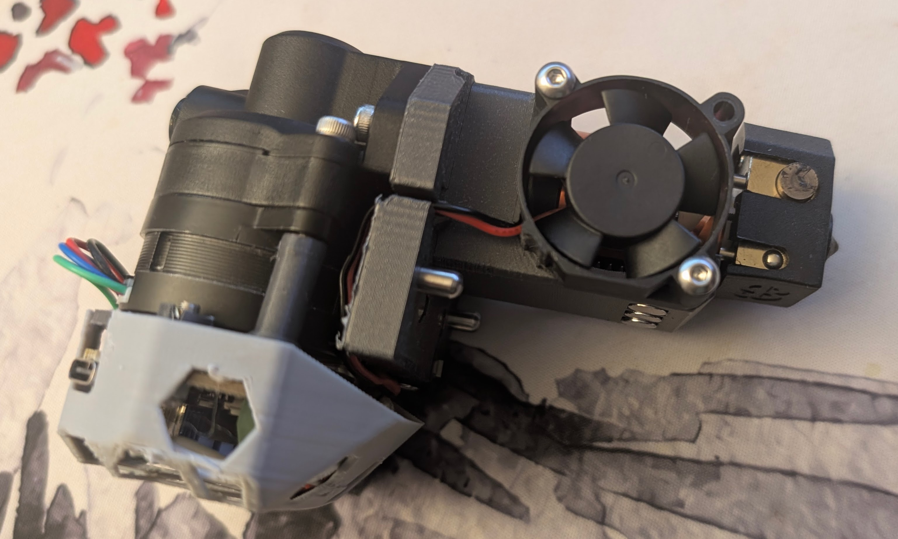

# What is this?

A minimalistic 3d printer toolhead design, build from ground up for tool changing.
Inspired by [Tapchanger](https://github.com/viesturz/tapchanger) and [Stealthchanger](https://github.com/DraftShift/StealthChanger). But not getting into  [PitStop](https://mihaidesigns.com/pitstop3/) territory yet.

## How is this different?

SimpleChanger is trying to capitalize on the following:
* Using a hotend with a built-in nozzle probe, like Revo PZ
* Very simple two point docking mechanism with magnets for the rest
* Use hotend's heatsink as a structural element.

While keeping it simple with no wires to the shuttle.

The presumtion is that by placing the holddown pins close to the center of mass, the rest of the holding force can be provided by a number of 6x3 magnets. And resulting weight reduction should further help.

# No more work here

This was abandoned in favor to [ClickChanger](https://github.com/viesturz/ClickChanger).

Fully assemebled prototype currently comes in at 240 grams, testing to start soon.

